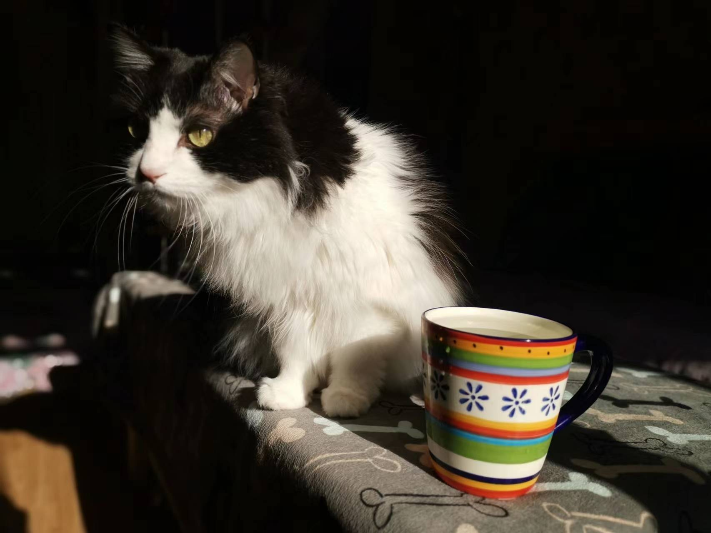

## General Information

I am Ruoxi Li, a graduate student specializing in Biostatistics at Columbia University's Irving Medical Center. Holding a Bachelor's degree in Preventive Medicine, my academic foundation is deeply rooted in the prevention and mitigation of health risks. My passion lies in harnessing the power of biostatistical methods to address medical challenges, with a particular focus on clinical trials and the development of new drugs.

## Skills

In terms of technical skills, I primarily utilize R for data analysis. Additionally, I have practical experience with SAS and SPSS, allowing me to proficiently handle and analyze data using these tools.

1. My previous internships were in hospitals, disease control centers, and public health service centers in various places. I am currently seeking internship opportunities in the industry.

2. I grew up in Wuhan and received my undergraduate education at the city's top medical college. During the pandemic, I was presented with numerous opportunities to strengthen my skills. This challenging period deepened my commitment to improve health and well-being.

3. I am a TV series enthusiast.

4. I have a cow cat in China.

Learn more about my academic and professional experience: [resume](About-me.html)
